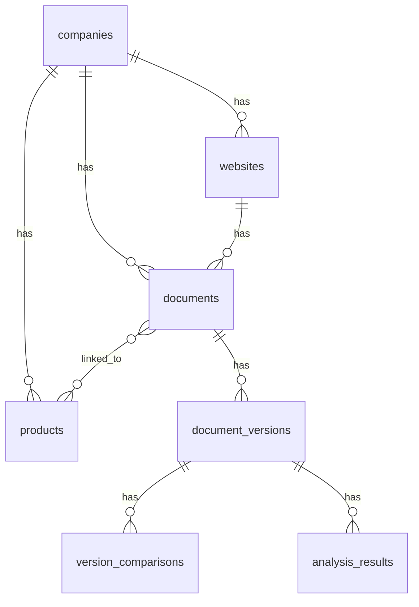

# Avant - Legal Document Tracking System

> **A comprehensive platform for monitoring, scraping, and analyzing privacy policies, terms of service, and other legal documents from companies and their products.**

[](https://laravel.com)
[](https://vuejs.org)
[](https://www.typescriptlang.org)
[](https://www.mysql.com)
[](https://tailwindcss.com)

---

## Overview

Avant enables organizations to:

- **Track companies** and their various products/services
- **Monitor multiple websites** per company
- **Auto-discover** legal documents (privacy policies, ToS, etc.)
- **Scrape & version** documents with change tracking
- **Link documents** to specific products within a company
- **Analyze** documents with AI-powered scoring *(planned)*

---

## Tech Stack

### Backend

| Technology | Version | Purpose |
|------------|---------|---------|
| **PHP** | 8.2+ | Runtime |
| **Laravel** | 12 | Framework |
| **MySQL** | 8.0+ | Database |
| **Laravel Queue** | - | Async job processing |

### Frontend

| Technology | Version | Purpose |
|------------|---------|---------|
| **Vue** | 3 | UI Framework |
| **Inertia.js** | - | SPA Bridge |
| **TypeScript** | 5 | Type Safety |
| **Tailwind CSS** | 3 | Styling |
| **shadcn-vue** | - | UI Components |

### Key Packages

```
symfony/dom-crawler       # HTML parsing and content extraction
league/html-to-markdown   # Convert HTML to Markdown
sebastian/diff            # Generate diffs between versions
laravel/fortify           # Authentication scaffolding
```

---

## Features

### Completed

#### Company Management
- [x] CRUD operations for companies
- [x] Company metadata (name, website, industry, description, location)
- [x] Tag support for categorization

#### Product/Service Tracking
- [x] Add products and services to companies (e.g., Disney+, Disney Games)
- [x] Product types: `Product` `Service` `Mobile App` `Game` `Platform` `Website` `Hardware`
- [x] Store product URLs, App Store links, Play Store links
- [x] Link documents to specific products
- [x] Mark primary documents for each product

#### Website Management
- [x] Track multiple websites per company
- [x] Mark primary website
- [x] Auto-discovery of policy URLs via:
  - `robots.txt` parsing
  - Sitemap crawling
  - Common path checking (`/privacy`, `/terms`, etc.)
  - Link crawling and keyword detection

#### Document Scraping
- [x] Manual document URL entry
- [x] Automatic policy discovery
- [x] Queue-based scraping with rate limiting
- [x] Content extraction and Markdown conversion
- [x] Version tracking with content hashing (SHA256)
- [x] Diff generation between versions
- [x] Scrape status tracking (`pending` `success` `failed` `blocked`)
- [x] Configurable scrape frequency (`hourly` `daily` `weekly` `monthly`)

### Planned

- [ ] **AI Analysis** - Automated document analysis using LLMs
- [ ] **Scoring** - Configurable criteria with A-F ratings
- [ ] **Alerts** - Email notifications on document changes
- [ ] **Public API** - REST API with webhook support
- [ ] **Diff Viewer** - Visual document comparison UI
- [ ] **Export** - PDF/CSV export capabilities

---

## Getting Started

### Prerequisites

```diff
+ PHP 8.2 or higher
+ Composer
+ Node.js 18+ and npm
+ MySQL 8.0+
- Redis (optional, for queue driver)
```

### Installation

#### 1. Clone the repository

```bash
git clone https://github.com/brooks7799/avant-app.git
cd avant-app
```

#### 2. Install PHP dependencies

```bash
composer install
```

#### 3. Install Node.js dependencies

```bash
npm install
```

#### 4. Environment configuration

```bash
cp .env.example .env
```

#### 5. Configure your `.env` file

```ini
APP_NAME=Avant
APP_URL=http://localhost:8000

DB_CONNECTION=mysql
DB_HOST=127.0.0.1
DB_PORT=3306
DB_DATABASE=avant
DB_USERNAME=your_username
DB_PASSWORD=your_password

QUEUE_CONNECTION=database
```

#### 6. Generate application key

```bash
php artisan key:generate
```

#### 7. Run database migrations

```bash
php artisan migrate
```

#### 8. Seed the database

```bash
php artisan db:seed
```

> Creates document types and scoring criteria

#### 9. Build frontend assets

```bash
npm run build
```

---

## Running the Application

### Development

Open **three terminal windows**:

**Terminal 1** - Laravel Server
```bash
php artisan serve
```

**Terminal 2** - Vite Dev Server
```bash
npm run dev
```

**Terminal 3** - Queue Worker
```bash
php artisan queue:work
```

Then visit: **http://localhost:8000**

### Production

```bash
# Build optimized assets
npm run build

# Cache configuration
php artisan config:cache
php artisan route:cache
php artisan view:cache

# Optimize autoloader
composer install --optimize-autoloader --no-dev
```

---

## Queue Configuration

### Supervisor Setup (Production)

Create `/etc/supervisor/conf.d/avant-worker.conf`:

```ini
[program:avant-worker]
process_name=%(program_name)s_%(process_num)02d
command=php /path/to/avant-app/artisan queue:work --sleep=3 --tries=3 --max-time=3600
autostart=true
autorestart=true
stopasgroup=true
killasgroup=true
numprocs=2
redirect_stderr=true
stdout_logfile=/path/to/avant-app/storage/logs/worker.log
```

Then run:
```bash
sudo supervisorctl reread
sudo supervisorctl update
sudo supervisorctl start avant-worker:*
```

---

## Scheduled Tasks

Add to crontab:

```bash
* * * * * cd /path/to/avant-app && php artisan schedule:run >> /dev/null 2>&1
```

---

## Artisan Commands

### Policy Discovery

```bash
# Discover policies on a website
php artisan policies:discover {website_id}

# Run synchronously (useful for debugging)
php artisan policies:discover {website_id} --sync
```

### Document Scraping

```bash
# Scrape a specific document
php artisan policies:scrape {document_id}

# Run synchronously
php artisan policies:scrape {document_id} --sync
```

### Batch Processing

```bash
# Queue all documents due for scraping
php artisan policies:crawl-all

# Force scrape all documents regardless of schedule
php artisan policies:crawl-all --force
```

---

## API Routes

### Companies

| Method | Endpoint | Description |
|--------|----------|-------------|
| `GET` | `/companies` | List all companies |
| `GET` | `/companies/{id}` | Show company details |
| `POST` | `/companies` | Create company |
| `PUT` | `/companies/{id}` | Update company |
| `DELETE` | `/companies/{id}` | Delete company |

### Websites

| Method | Endpoint | Description |
|--------|----------|-------------|
| `POST` | `/companies/{company}/websites` | Add website |
| `PUT` | `/websites/{id}` | Update website |
| `DELETE` | `/websites/{id}` | Delete website |
| `POST` | `/websites/{id}/discover` | Trigger policy discovery |

### Documents

| Method | Endpoint | Description |
|--------|----------|-------------|
| `POST` | `/websites/{website}/documents` | Add document |
| `PUT` | `/documents/{id}` | Update document |
| `DELETE` | `/documents/{id}` | Delete document |
| `POST` | `/documents/{id}/scrape` | Trigger scrape |

### Products

| Method | Endpoint | Description |
|--------|----------|-------------|
| `POST` | `/companies/{company}/products` | Add product |
| `PUT` | `/products/{id}` | Update product |
| `DELETE` | `/products/{id}` | Delete product |
| `POST` | `/products/{id}/documents` | Link documents |
| `DELETE` | `/products/{id}/documents/{doc}` | Unlink document |

---

## Project Structure

```
avant-app/
├── 📁 app/
│   ├── 📁 Console/Commands/      # Artisan commands
│   ├── 📁 Http/Controllers/      # HTTP controllers
│   ├── 📁 Jobs/                  # Queue jobs
│   ├── 📁 Models/                # Eloquent models
│   └── 📁 Services/Scraper/      # Scraping services
│       ├── 📁 DTO/               # Data transfer objects
│       ├── 📄 ContentExtractorService.php
│       ├── 📄 DiffService.php
│       ├── 📄 DocumentScraperService.php
│       ├── 📄 HttpClientService.php
│       ├── 📄 MarkdownConverterService.php
│       ├── 📄 PolicyDiscoveryService.php
│       └── 📄 VersioningService.php
├── 📁 config/
│   └── 📄 scraper.php            # Scraper configuration
├── 📁 database/
│   ├── 📁 migrations/            # Database migrations
│   └── 📁 seeders/               # Database seeders
├── 📁 resources/js/
│   ├── 📁 components/            # Vue components
│   ├── 📁 layouts/               # Page layouts
│   └── 📁 pages/                 # Vue pages
└── 📁 routes/
    └── 📄 web.php                # Web routes
```

---

## Database Schema



| Table | Description |
|-------|-------------|
| `companies` | Company information |
| `products` | Products/services per company |
| `websites` | Websites per company |
| `documents` | Legal document URLs |
| `document_types` | Categories (Privacy Policy, ToS, etc.) |
| `document_versions` | Scraped content with versioning |
| `version_comparisons` | Diffs between versions |
| `document_product` | Many-to-many linking |
| `scrape_jobs` | Job execution tracking |
| `discovery_jobs` | Discovery execution tracking |
| `tags` / `taggables` | Polymorphic tagging |
| `scoring_criteria` | AI scoring criteria definitions |
| `document_scores` | Scores per criteria |
| `analysis_results` | AI analysis storage |

---

## Configuration

### Scraper Settings

Edit `config/scraper.php`:

```php
return [
    'user_agent' => 'AvantBot/1.0',
    'timeout' => 30,
    'connect_timeout' => 10,
    'max_redirects' => 5,

    'rate_limiting' => [
        'requests_per_minute' => 30,
        'delay_between_requests' => 2000, // ms
    ],

    'retry' => [
        'times' => 3,
        'sleep' => 1000, // ms
    ],

    'discovery' => [
        'common_paths' => [
            '/privacy',
            '/privacy-policy',
            '/terms',
            '/terms-of-service',
            // ...
        ],
    ],
];
```

---

## Contributing

```bash
# 1. Fork the repository

# 2. Create a feature branch
git checkout -b feature/amazing-feature

# 3. Commit your changes
git commit -m 'Add amazing feature'

# 4. Push to the branch
git push origin feature/amazing-feature

# 5. Open a Pull Request
```

---

## License

This project is proprietary software. All rights reserved.

---

<p align="center">
  Built with ❤️ using Laravel & Vue
</p>
